# 楚河汉界 · 三维象棋

一款可以和朋友联机对战的**网页三维中国象棋**。打开网页即玩，手机、平板、电脑通用，无需下载注册。

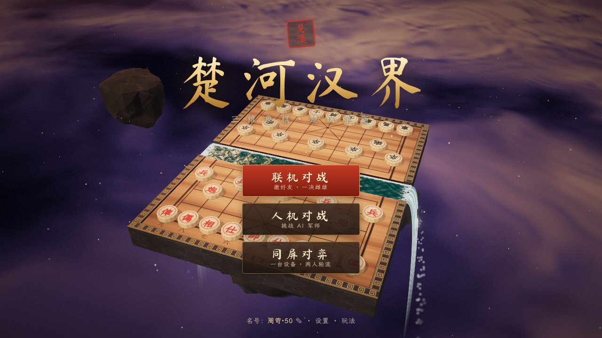

## 截图

| | |
| --- | --- |
| 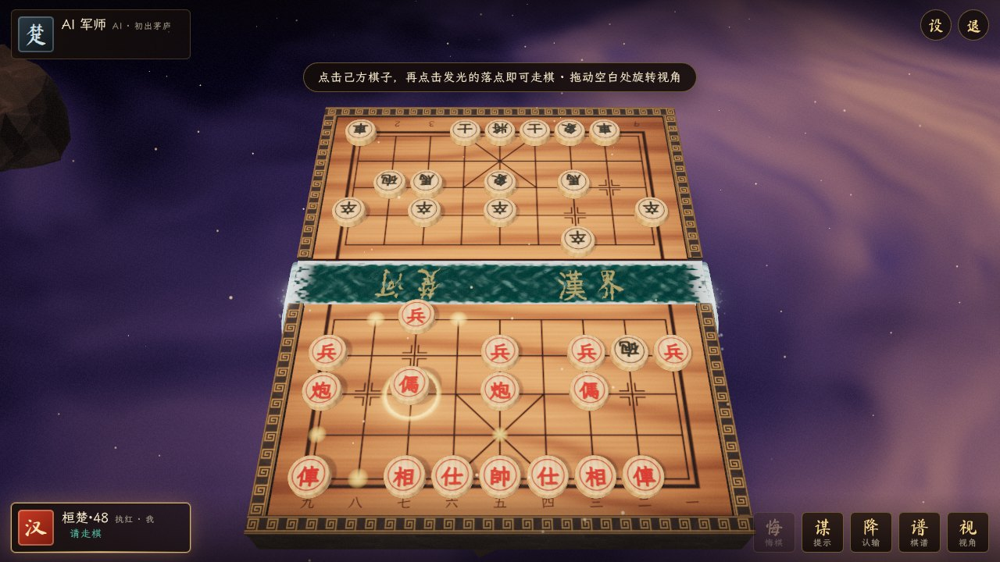 对局界面 | 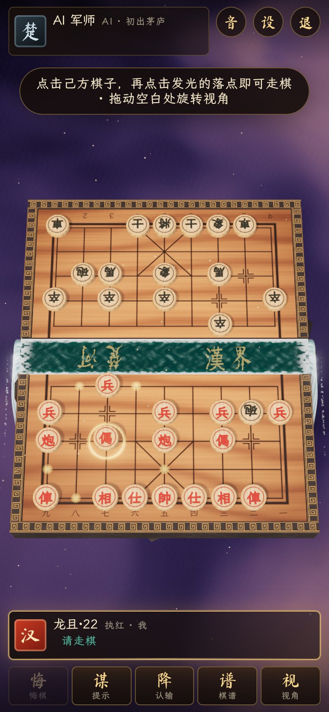 手机竖屏 |
| 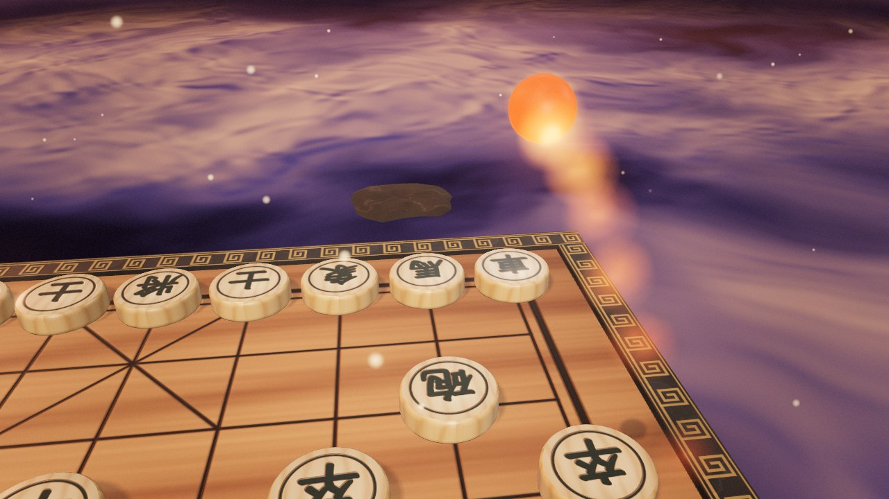 炮：子弹时间追踪炮弹 |  车：驷马战车涉水冲锋 |
|  马：铁骑突袭 | 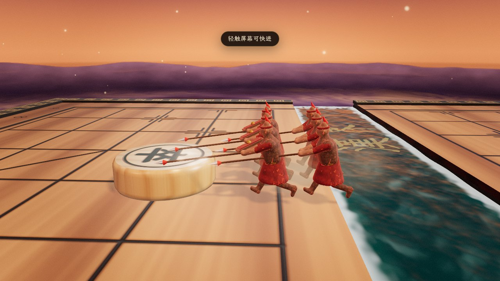 兵：长矛方阵突刺 |
| 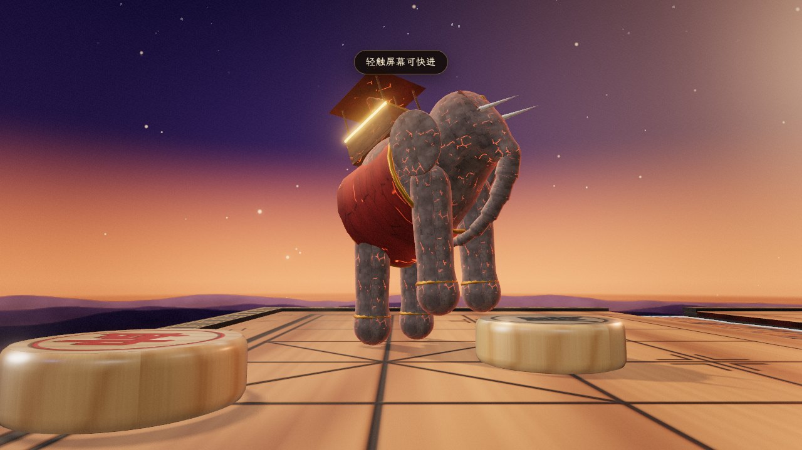 相：战象践踏 | 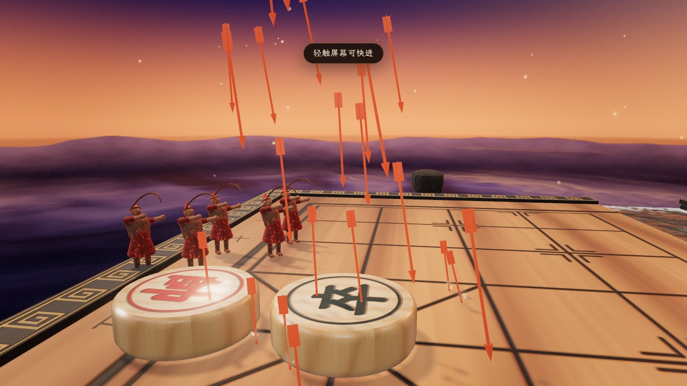 士：万箭齐发 |
| 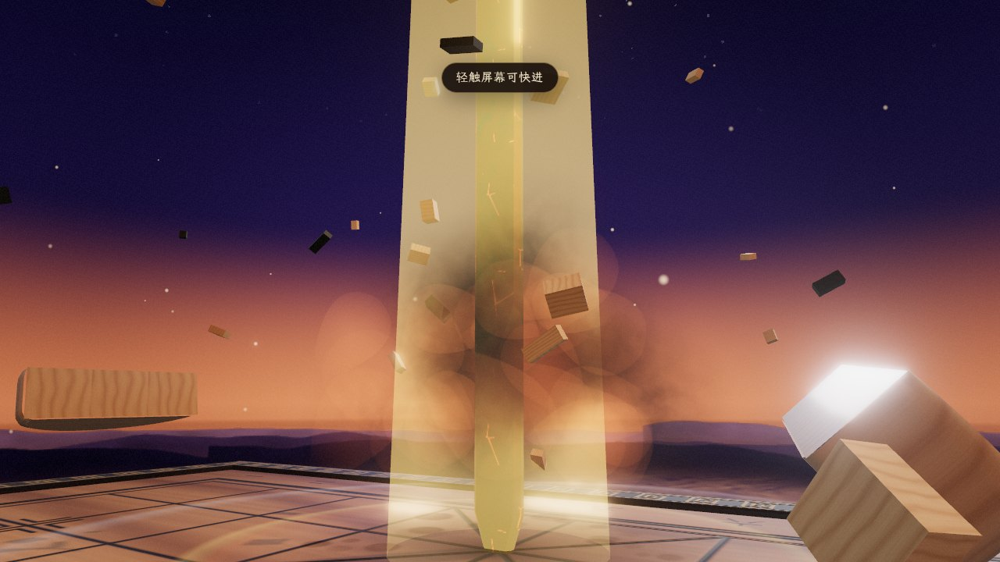 帅：天子之剑 | 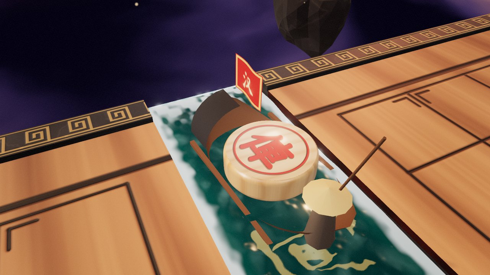 过河：乘舟摆渡 |
| 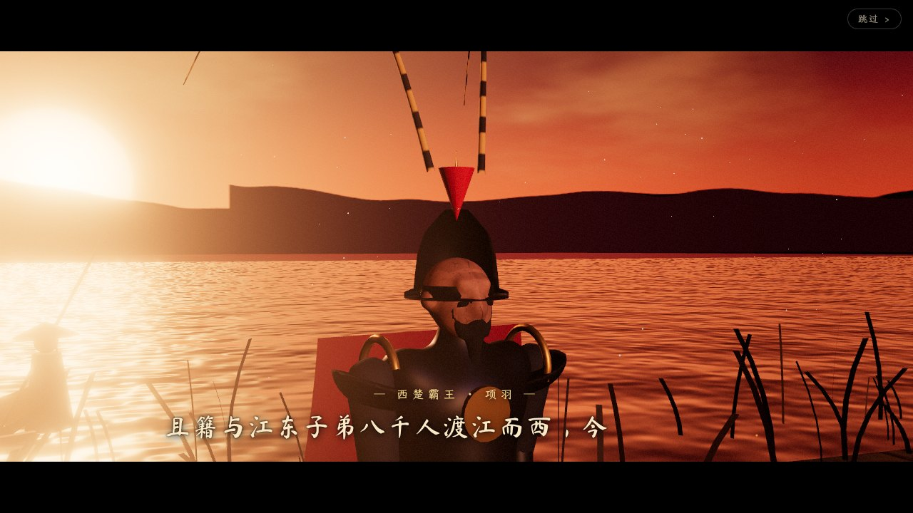 结局 · 乌江：“且籍与江东子弟八千人渡江而西……” | 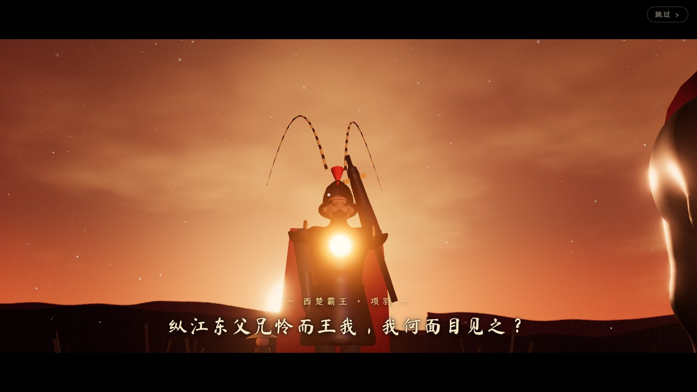 结局 · 乌江：举剑向天 |
| 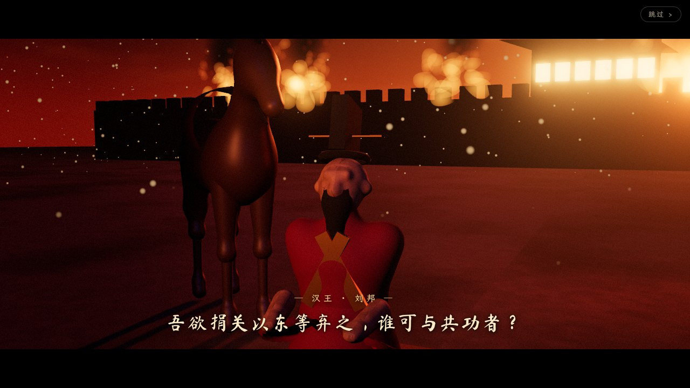 结局 · 彭城：“吾欲捐关以东等弃之……” | |

## 特色

- **真实的木质棋子与棋盘**：黄杨木车削棋子、刻字描漆；花梨木棋盘嵌于回纹石框，棋盘浮于黄昏云海之上。
- **楚河汉界是真正流动的河水**：河水顺流而下，从棋盘两端化作瀑布坠入云海；河床上刻着金色的“楚河”“漢界”。
- **棋子过河乘舟**：船家撑篙摆渡，棋子跳上小船横渡楚河汉界，兵卒过河时还有将士执旗随行。
- **每一次吃子都是一场战役**（兵马俑复活，战罢化为尘土）：
  | 棋子 | 战斗电影 |
  | --- | --- |
  | 炮 | 青铜火炮现身，炮弹越过“炮架”，子弹时间追踪镜头，爆炸、焦痕、震屏 |
  | 车 | 驷马战车冲锋涉水，把敌子撞飞 |
  | 马 | 重甲铁骑突袭，人立而起，挥刀将敌子一劈两半 |
  | 兵/卒 | 长矛方阵突刺；平时走子则步卒列阵行进 |
  | 相/象 | 战象人立践踏，地动山摇 |
  | 仕/士 | 弓弩手万箭齐发，箭雨钉满敌子 |
  | 帅/将 | 天子之剑从天而降，贯地而入 |
- **将军**：战鼓铜锣 + 书法“将”字印章；**绝杀**：败方将帅翻倒，“绝杀”朱印落下。
- **结局电影**（根据《史记》设计）：
  - 楚（黑方）败：**乌江**。血色残阳、飞雪芦苇、乌江亭长檥船以待，项羽回身：“天之亡我，我何渡为！”“纵江东父兄怜而王我，我何面目见之？”随后《垓下歌》，以杜牧“卷土重来未可知”作结。
  - 汉（红方）败：**彭城**。城火冲天、狂沙蔽日，汉王下马踞鞍：“吾欲捐关以东等弃之，谁可与共功者？”“吾宁斗智，不能斗力！”
  - 台词配有书法字幕与语音朗读（浏览器中文语音，可在设置中关闭）。
- **联机对战**：创建房间 → 把链接 / 二维码 / 六位房间号发给好友 → 好友打开即入座。支持悔棋、求和、认输、再战（自动交换先后手）、快捷传书、断线重连、观战、对局计时（动画时间不计入用时）。
- **人机对战**：三档 AI 军师（初出茅庐 / 运筹帷幄 / 兵仙韩信），还可以请“军师”给出提示。
- **同屏对弈**：一台设备两人轮流，视角自动翻转。
- **程序化生成的一切**：所有模型、贴图、音效、古筝配乐都在浏览器中实时生成，不依赖任何外部素材（仅内置两款开源书法字体的子集）。
- **完整规则**：将帅照面、蹩马腿、塞象眼、炮打隔子、困毙判负、长将判负、三次重复局面和棋、六十回合无吃子和棋、中文记谱（“炮二平五”）。

## 快速开始

需要 Node.js 20+。

```bash
npm install
npm run dev        # 开发模式，打开终端里显示的地址（手机可用局域网地址访问）
```

完整运行（含联机服务器）：

```bash
npm run build
npm start          # http://localhost:3000，同一局域网内的手机访问 http://<电脑IP>:3000
```

运行测试：`npm test`（规则引擎 perft 校验 + 房间逻辑测试）。

## 部署与联机方式

游戏支持两种联机方式，前端会**自动选择**：

1. **自建服务器（最稳定）**：页面由 `npm start` 的 Node 服务器提供时，自动使用该服务器的 WebSocket 房间。
2. **无服务器（最省事）**：页面是纯静态托管时，通过公共 MQTT 中继（EMQX / HiveMQ / Mosquitto 公共 Broker）联机，由**房主的浏览器**担任裁判。房主需保持页面开启；房主刷新页面后会自动恢复房间。

### 方式一：GitHub Pages（免费、无需服务器）

1. 仓库 **Settings → Pages → Build and deployment → Source** 选择 **GitHub Actions**。
2. 推送到默认分支（或在 Actions 页手动运行 “Deploy to GitHub Pages”）。
3. 访问 `https://<你的用户名>.github.io/<仓库名>/`，把链接发给朋友即可。

也可以把 `npm run build` 生成的 `dist/` 目录上传到 Cloudflare Pages、Netlify、Vercel 等任意静态托管。

### 方式二：Render（一键部署 Node 服务器）

Render 控制台 → **New → Blueprint** → 选择本仓库（使用仓库中的 `render.yaml`）。部署完成后访问分配的网址即可，联机走自己的服务器。

### 方式三：Docker / 云服务器

```bash
docker build -t chuhan .
docker run -p 3000:3000 chuhan
```

### 静态页面 + 独立服务器

构建时指定服务器地址：`VITE_SERVER_URL=wss://your-server.example.com npm run build`，或在链接后加 `?server=wss://your-server.example.com`。

其他 URL 参数：`?relay=1` 强制使用 MQTT 中继；`?broker=wss://...` 指定自建 MQTT Broker（需支持 WebSocket）；`?q=low|medium|high` 指定画质。

## 操作

- 点击己方棋子，再点击发光的落点走棋（红色旋转光环表示可吃子）。
- 拖动空白处旋转视角，双指捏合或滚轮缩放；“视”按钮在己方视角 / 俯瞰 / 对方视角间切换。
- 设置中可调整战斗特效（完整电影 / 精简 / 关闭）、画质、音效、配乐、语音。
- 电影播放中可点“跳过”。

## 技术结构

```
shared/      规则引擎（xiangqi.js）、AI（ai.js）、联机房间权威逻辑（room.js），前后端共用
server/      Node 静态服务 + WebSocket 房间服务器
src/render/  Three.js 舞台、镜头、棋盘、河水瀑布、棋子、程序化纹理
src/fx/      粒子、碎片、兵马俑材质、距离场雕刻模型、各兵种战斗电影
src/ending/  结局场景（乌江 / 彭城）与人物
src/audio/   Web Audio 合成音效与生成式古筝配乐
src/net/     MQTT 客户端、传输层、联机客户端
src/ui/      界面
```

## 致谢

- 字体：[霞鹜文楷](https://github.com/lxgw/LxgwWenKai)、[马善政毛笔楷书](https://github.com/google/fonts/tree/main/ofl/mashanzheng)（SIL Open Font License，已按游戏用字子集化，见 `public/fonts/`）。修改文案后可运行 `npm run fonts` 重新生成子集（需 `pip install fonttools brotli`）。
- 3D 引擎：[three.js](https://threejs.org/)。
- 台词出自《史记·项羽本纪》《史记·高祖本纪》《史记·留侯世家》，诗句出自项羽《垓下歌》、杜牧《题乌江亭》。
